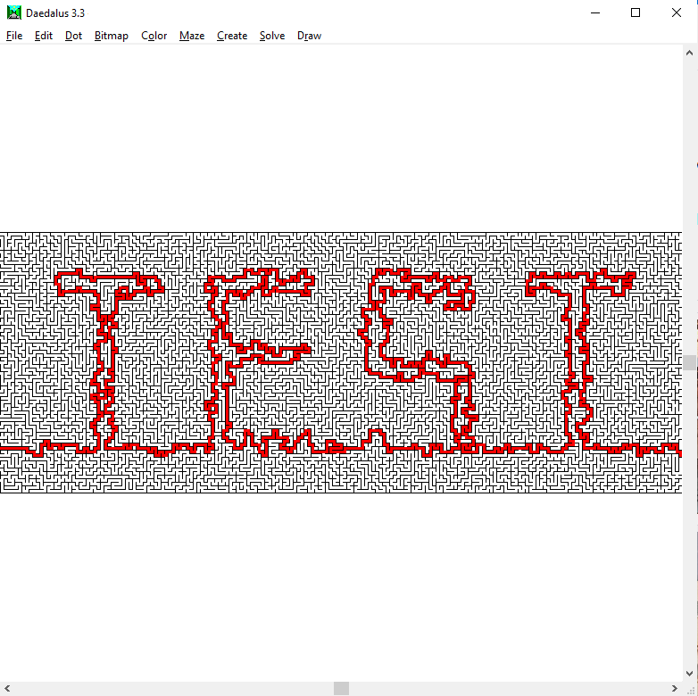

# Secret Santa 2020
This repository contains details of a mystery puzzle game created as a Secret Santa gift given in Christmas 2020.

## Background
The Secret Santa was arranged within a Facebook group of puzzle game enthusiasts from around the world. Games could be created on any theme, and use any variety of media - physical, digital, or experiential
I wanted to create a light-hearted game, and I thought it was appropriate to make one that was loosely Christmas-themed. So, I went for a "Scrooge"-inspired story about a mean ruler who, despite wanting for nothing, felt no joy. Each puzzle would be themed around a different gift which one of her subjects made to try to please her, and the final metapuzzle would involve extracting parts from each of the individual puzzle solutions to create the *ultimate* Christmas gift.

I felt that this provided enough scaffolding for the game - it provided some thematic context, an objective and motivation for the player, and plenty of opportunities to integrate different puzzle types. Since storytelling is not my strongest skill, I thought I could make up for it somewhat my writing all the text in rhyming verse, as in a children's fairytale.

## Hints
If you are one of the two people in the world who have received a copy of the game, you may want to refer to the [Hints](/hints.md) 

## Design and Build Notes
Almost all of the game was created using free, open-source software:
- I used [Inkscape](https://inkscape.org/) for all the 2D vector art design, including the shields, the fish, and the chessboard.  
- Wooden parts were laser engraved on my Eleksmaker using [LaserGRBL](http://lasergrbl.com/), then cut on a scroll saw, and painted by hand.
- The cook's menu was designed in [Krita](https://krita.org/).
- The jeweller's rings were designed in [OpenSCAD](https://www.openscad.org/) using [this script](https://github.com/alastaira/secret-santa-2020/blob/main/code/jeweller_ring.scad), prepared in Cura, and then printed on a Creality CR10s 3D printer.
- The seamstress' labyrinth was created using [Daedalus](https://www.astrolog.org/labyrnth/daedalus.htm), using [this script](https://github.com/alastaira/secret-santa-2020/blob/main/code/seamstress_labyrinth.ds).
- The snippets of text were written in [Libre Writer](https://www.libreoffice.org/discover/writer/)

| | | | |
| --- | --- | --- | --- |
|  |  |  |  |
|  |  |  |  |
|  |  |  |  |
|  | | | |

