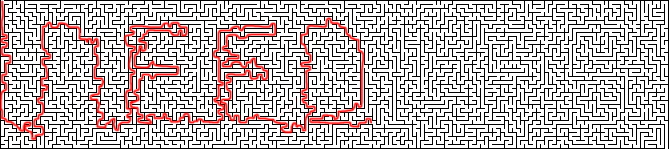

# Hints

## General Hints
 - The solution to every puzzle is a single word answer.
 - Those answer words are connected in some way to the puzzle.
 - The number of letters in each answer is indicated by the dashes on the corresponding envelope.
 - The vast majority of information required to solve the puzzles is contained within the box. However, you may if desired use any tools or resources to help you.
 
## The Jeweller

  
Hint #1

  Reading the poem, can you work out which ring is made from which material?

  
Hint #2

  Line up the rings next to each other in the correct order. If the rings are too small for your fingers, perhaps try stacking them on a pencil.

  
Hint #3

  You may need to flip some of the rings around - do the symbols resemble letters?

  
Solution

  ETERNAL 
  

## The Cook

## The Fisherman

## The Seamstress

  
Hint #1

  This is a labyrinth. You need to trace the route from the top-left hand corner to the bottom-right hand corner.

  
Hint #2

  Rather than drawing the path on the cloth, you may find this image helpful:
  

  
Hint #3

  The path should resemble a word that is relevant to the puzzle.

  
Partial Solution

  

  
Partial Solution #2

  

  
Solution

  NEEDLES 
  

## The Blacksmith

## The Knight

  
Hint #1

  This is a "Knight's Tour" puzzle.

  
Hint #2

  Starting at the bottom left square, move the piece around the board as a knight's piece would move in chess, and take note of the letters visited along the route. You must visit every square on the board exactly once, and end at the bottom right hand square.

  
Hint #3

  The answer starts with the words "THE ANSWER..." 

  
Hint #4

  The following image shows the sequence of moves you should make: 
  

  
Solution

  THE ANSWER TO THIS KNIGHT'S TOUR IS PEASANTS

## The Clockmaker

## The Gardener

## The Jester
