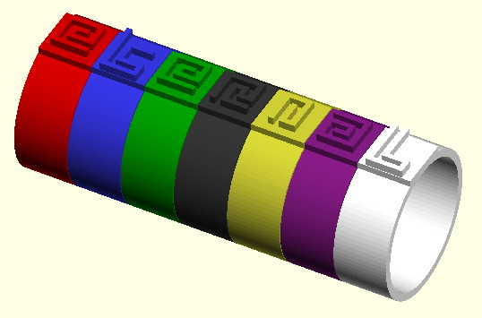
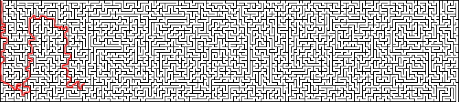
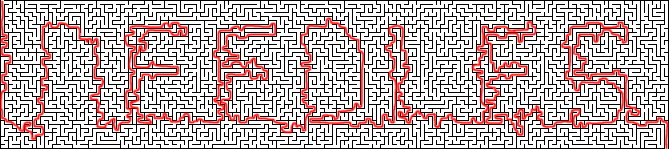

# Hints

## General Hints
 - The solution to every puzzle is a single word answer.
 - Those answer words are connected in some way to the puzzle.
 - The number of letters in each answer is indicated by the dashes on the corresponding envelope.
 - The vast majority of information required to solve the puzzles is contained within the box. However, you may choose to use any external tools or resources to help you.
 
## The Jeweller

  
Hint #1

  Reading the poem, can you work out which ring is made from which material?

  
Hint #2

  Line up the rings next to each other in the correct order. If the rings are too small for your fingers, perhaps try stacking them on a pencil.

  
Hint #3

  You may need to flip some of the rings around - do the symbols resemble letters?

  
Solution

  ETERNAL 
  

## The Cook

  
Hint #1

  This is a menu of dishes from around the world. Perhaps you should try translating the names of each dish into English?

  
Hint #2

  If you're not sure what the original language was, examine the coloured banner - does that resemble anything that might help?

  
Hint #3

  Each dish has a two-word name, and you should notice a common pattern shared between them.

  
Hint #4

  The English name of every dish is named after a country, e.g. "FRENCH DRESSING", and is written in the language of that country, e.g. VINAIGRETTE. 
 Write out the similar two-word name of each dish.

  
Hint #5

  The number of letters in each name is indicated by the diamonds underneath the title. Pick out the letter indiciated by the black diamonds to spell a word.

  
Solution

  PASTIES

## The Fisherman

  
Hint #1

  You need to identify each of the creatures depicted on the transparencies, and their position on the line.

  
Hint #2

  Having done that, look carefully at the line to notice the highlighted letter from each name that you should extract.

  
Solution

  BRINY

## The Seamstress

  
Hint #1

  This is a labyrinth. You need to trace the route from the top-left hand corner to the bottom-right hand corner.

  
Hint #2

  Rather than drawing the path on the cloth, you may find this image helpful:
  

  
Hint #3

  The path should resemble a word that is relevant to the puzzle.

  
Partial Solution

  

  
Partial Solution #2

  

  
Solution

  NEEDLES 
  

## The Armourer

  
Hint #1

  Read the Armourer's statement carefully about the types of people he has previously made shields for. What might they have chosen to depict on their shields?

  
Hint #2

  You may want to refer to an external source for the next bit.

  
Hint #3

  The symbols represent (American) Sign Language, Morse Code, and Braille.

  
Solution

  AID

## The Knight

  
Hint #1

  This is a "Knight's Tour" puzzle.

  
Hint #2

  Starting at the bottom left square, move the piece around the board as a knight's piece would move in chess, and take note of the letters visited along the route. You must visit every square on the board exactly once, and end at the bottom right hand square.

  
Hint #3

  The answer starts with the words "THE ANSWER..." 

  
Hint #4

  The following image shows the sequence of moves you should make: 
  

  
Solution

  THE ANSWER TO THIS KNIGHT'S TOUR IS PEASANTS

## The Clockmaker

## The Gardener

## The Jester

## The Final Gift
